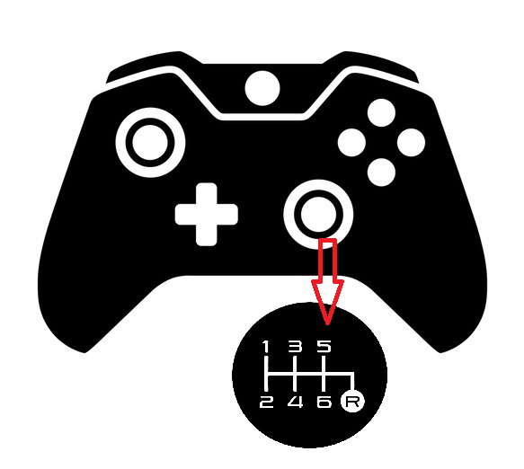
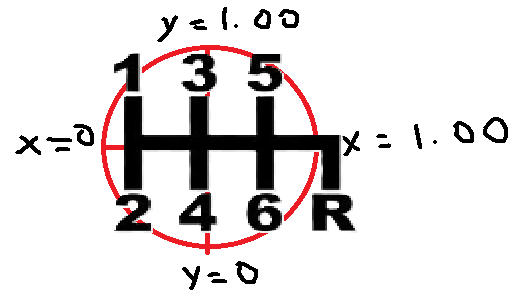

# BeamNG.Drive H-Shifter Joystick Mod 

Joystick-based H-pattern shifter mod for BeamNG.Drive, allowing you to shift gears using a gamepad analog stick.

Unlike traditional button-based shifting or sequential stick controls that operate more like paddle shifters, this system replicates a **true manual gearbox** by mapping the gears to specific joystick positions. This offers several advantages:

- **More Realistic**: Simulates the movement of a real H-shifter, making it ideal for players who want a more immersive manual shifting experience without a dedicated H-pattern shifter.
- **Tactile and Intuitive**: Once learned, it allows for **faster** and **more deliberate shifts**, compared to sequential shifting where you can only go up or down one gear at a time.
- **Greater Control**: No need to cycle gears. **Reverse** or **Neutral** at any time. Jumping from **6th to 2nd** instantly (e.g., for an engine-braking maneuver) is **not possible** with a sequential shifter, but it is with this system.

## Installation

1. Download the mod files.
2. Place the mod in your `mods/unpacked` directory.
3. Bind Controls:
   1. Open BeamNG.Drive **Options > Controls**
   2. Manually assign **H-Shifter X-Axis** and **H-Shifter Y-Axis** to your joystick. You will need to unmap the camera
   3. Map **H-Shifter R3** for reverse controls
4. Restart BeamNG.Drive to apply the mod.

## Controls

The stick is split into 6 "zones" that represent the gears

| Gear | X Position | Y Position | Description      |
|------|-----------|-----------|------------------|
| 1    | 0.05      | 0.90      | Top-left        |
| 2    | 0.05      | 0.10      | Bottom-left     |
| 3    | 0.50      | 0.90      | Top-center      |
| 4    | 0.50      | 0.10      | Bottom-center   |
| 5    | 0.95      | 0.90      | Top-right       |
| 6    | 0.95      | 0.10      | Bottom-right    |

- The car will shift to the selected gear with or without the clutch like a real gearbox
- Shifting to a gear and then shifting to that gear again will put the car in **Neutral** 
- Holding R3 and moving the stick to the right will put the car in **Reverse**

